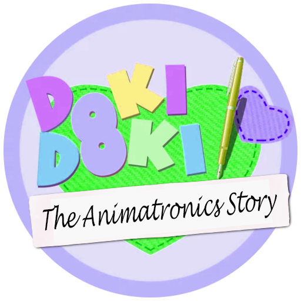
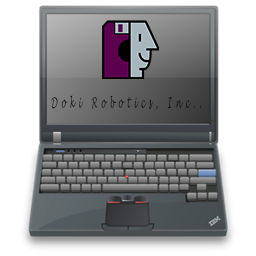

#Welcome to my DDLC Mod!

  

DDLC The Animatronics Story is a mod made by Aroko-chan for the **original** Doki Doki Literature Club that creates a new story for the original Literature Club.

> Additionaly [here](.github/CREDITS_HARDWARE.md) are all the contributors that create the modding system and my hardware.

### Disclaimers
   - <u>Team Salvato</u>
      > This is a DDLC mod that is not afilliated in anyway with Team Salvato.
   - <u>GanstaKingofSA</u>
      > This is a mod made using his mod template that you can download from: https://github.com/GanstaKingofSA/DDLCModTemplate2.0.
   - <u>Aroko-chan Systems and Modding</u>
      > This mod has been made by Aroko-chan Systems and Modding. I don't allow any type of modification of this mod without my permision. To contact me, send me an e-mail at this adress: octavianresmeritamihai@gmail.com

### **System Requirements**
   1. Windows 7, Windows 8.1, Windows 10, Windows 11
   2. Any type of Linux build from Ubuntu/Debian's kernel. Arch is not supported
   3. A clean copy of DDLC that can be downloaded from https://ddlc.moe or Steam

### Mod's Features
1. A free DLC named Shadows of Love
2. A lot of Achievements
3. Easter Eggs.
3. Different Colors for every menu
4. Secret Text Files 

### DOKI ROBOTICS, INC.

  

### About DOKI ROBOTICS INC.
DOKI ROBOTICS INC. is a Animatronics Building Service company with over 35 years of experience. Using high-tech technology for funtime and power to create the best experience for our customers.

Originally founded in Japan, you can get parts and services from our technicians through our contacting server. Every animatronic that we build are designed by the owners of this company.

>Our Values:
1. Excellent communication
2. High-quality parts
3. Fast shipping
4. Very Stable Architecture
5. Long-lasting supoort and security

Copyright © 2019-2023 Aroko-chan Systems. All rights reserved.

Copyright © 2019-2023 Azariel Del Carmen (GanstaKingofSA). All rights reserved.

Doki Doki Literature Club, the Doki Doki Literature Club code, is the property of Team Salvato (Dan Salvato LLC). Copyright © 2017 Team Salvato. All rights reserved.
